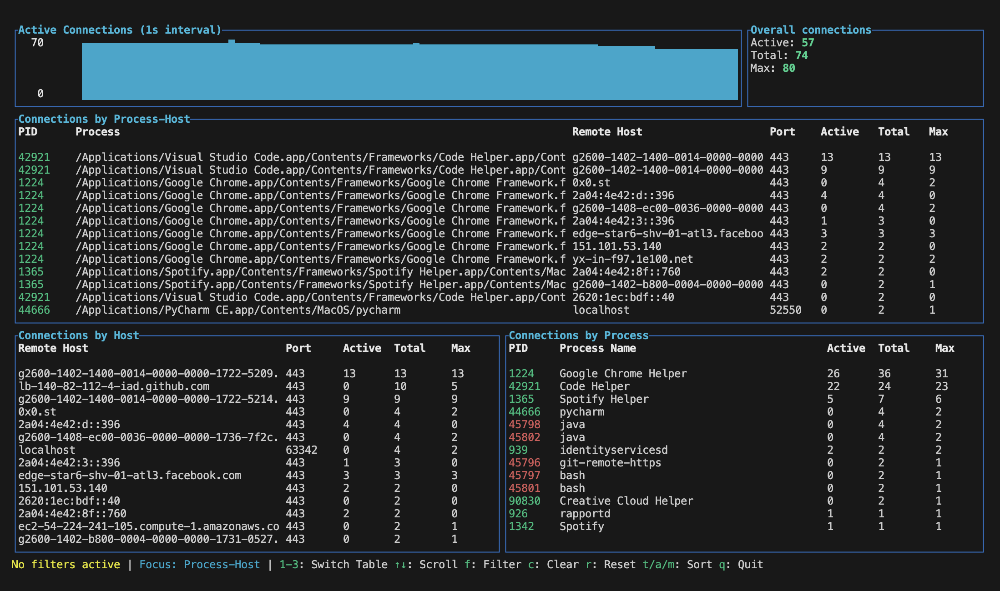

# tcpcount

A terminal-based TCP connection monitoring tool that provides real-time visualization of network connections on your system.



## What does tcpcount do?

tcpcount is a command-line tool that monitors TCP connections on your system and displays them in an easy-to-read dashboard. It shows:

- **Active connections** in real-time
- **Connection statistics** grouped by remote host, process, and process-host combinations
- **Historical data** with graphs showing connection trends over time
- **Filtering capabilities** to focus on specific processes, hosts, or ports

**Concurrency Analysis:** tcpcount is particularly useful for understanding connection concurrency patterns. It tracks not just current active connections, but also the maximum number of concurrent connections reached over time. This helps you understand:

- How many connections your applications are making simultaneously
- Peak connection usage and potential bottlenecks
- Whether connection pooling is working effectively
- Connection patterns that might indicate performance issues
- Resource utilization for capacity planning

This is useful for system administrators, network engineers, and anyone who needs to monitor network activity on their system. 

## Installation

### Prerequisites

You'll need Rust and Cargo installed on your system. If you don't have them:

**On macOS/Linux:**
```bash
curl --proto '=https' --tlsv1.2 -sSf https://sh.rustup.rs | sh
source ~/.cargo/env
```

### Building and Installing

1. **Clone or download the source code** to your system
2. **Navigate to the project directory** in your terminal
3. **Build and install** with cargo:

```bash
cargo build --release
cargo install --path .
```

This will compile the application and install it to your cargo bin directory (usually `~/.cargo/bin/` on macOS/Linux).

### Alternative: Run directly without installing

If you prefer not to install globally, you can run it directly:

```bash
cargo run --release
```

## Usage

### Basic Usage

Run tcpcount without any arguments to monitor all TCP connections:

```bash
tcpcount
```

### Command-line Options

tcpcount supports several filtering options:

```bash
# Filter by process ID
tcpcount -p 1234

# Filter by process name (case-sensitive)
tcpcount -n "firefox"

# Filter by remote host
tcpcount -H "google.com"

# Filter by remote port
tcpcount -P 443

# Combine multiple filters
tcpcount -n "chrome" -P 80
```

**Available Options:**
- `-p, --pid <PID>` - Filter by process ID
- `-n, --process-name <NAME>` - Filter by process name (substring match)
- `-H, --host <HOST>` - Filter by remote host (substring match)
- `-P, --port <PORT>` - Filter by remote port

## Interface Overview

The tcpcount interface is divided into several sections:

```
┌─────────────────────────────────────────────────────────────────────────────┐
│                    [Connection Graph]           [Summary Stats]              │
├─────────────────────────────────────────────────────────────────────────────┤
│                                                                             │
│                        [Process-Host Table]                                 │
│                                                                             │
├─────────────────────────────────────────────────────────────────────────────┤
│              [Host Table]              │           [Process Table]          │
├─────────────────────────────────────────────────────────────────────────────┤
│                            [Status Bar]                                     │
└─────────────────────────────────────────────────────────────────────────────┘
```

### Sections Explained

1. **Connection Graph** - Shows active connections over time
2. **Summary Stats** - Displays current totals and statistics
3. **Process-Host Table** - Shows connections grouped by process and remote host
4. **Host Table** - Shows connections grouped by remote host
5. **Process Table** - Shows connections grouped by process name
6. **Status Bar** - Shows current filters and available keyboard shortcuts

### Table Columns

**Host Table:**
- Remote Host: The hostname or IP address
- Port: The remote port number
- Active: Currently active connections
- Total: Total connections seen
- Max: Maximum concurrent connections

**Process Table:**
- Process: Process name
- PID: Process ID
- Active: Currently active connections
- Total: Total connections seen
- Max: Maximum concurrent connections

**Process-Host Table:**
- Process: Process name
- Remote Host: The hostname or IP address
- Port: The remote port number  
- Active: Currently active connections
- Total: Total connections seen
- Max: Maximum concurrent connections

## Keyboard Shortcuts

### Navigation
- **↑/↓ Arrow Keys** - Scroll up/down in the focused table
- **Page Up/Page Down** - Scroll by larger increments
- **Home/End** - Jump to top/bottom of the focused table
- **1/2/3** - Switch focus between tables:
  - **1** - Focus Process-Host table
  - **2** - Focus Host table  
  - **3** - Focus Process table

### Filtering and Sorting
- **f** - Open filter dialog to set custom filters
- **c** - Clear all active filters
- **t** - Sort by Total connections
- **a** - Sort by Active connections
- **m** - Sort by Max concurrent connections

### Control
- **r** - Reset/refresh connection data
- **q** - Quit the application

### Mouse Support
- **Scroll Wheel** - Scroll the focused table up/down

## Examples

### Monitor a specific application
```bash
# Monitor Chrome browser connections
tcpcount -n "chrome"

# Monitor SSH connections
tcpcount -P 22
```

### Monitor connections to specific hosts
```bash
# Monitor connections to Google services
tcpcount -H "google"

# Monitor HTTPS connections
tcpcount -P 443
```

### Monitor a specific process
```bash
# Monitor process with PID 1234
tcpcount -p 1234
```

## Tips

1. **Use filters** to focus on specific network activity you're interested in
2. **Switch between tables** (1/2/3 keys) to view data from different perspectives
3. **Use sorting** (t/a/m keys) to prioritize different aspects of connection data
4. **Check the status bar** for current filters and available shortcuts
5. **Use the graph** to spot patterns in connection activity over time

## Requirements

- **Operating System:** Linux or macOS
- **Rust:** 1.70 or later
- **Privileges:** May require elevated privileges (sudo/admin) to access all network information on some systems

## Troubleshooting

**Permission Issues:**
If you get permission errors, try running with elevated privileges:
```bash
sudo tcpcount  # Linux/macOS
```

**Build Errors:**
Make sure you have the latest stable Rust version:
```bash
rustup update stable
```

**No Data Showing:**
- Check if there are active TCP connections on your system
- Try running without filters first
- Ensure you have the necessary permissions to read network information
